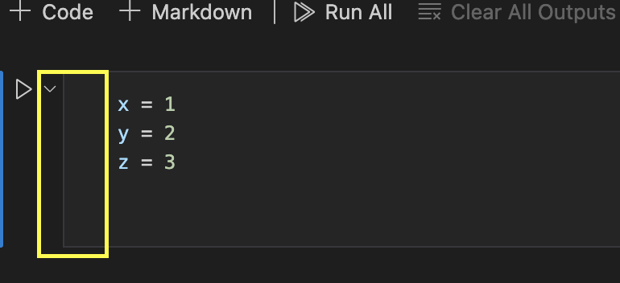
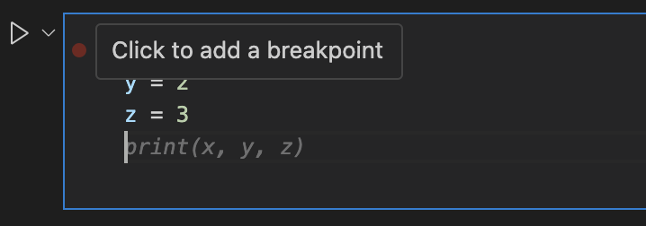

# Step 9

In Step 9, we will focus on debugging Python code using Visual Studio Code (VSCode) and Jupyter Notebooks (`.ipynb` files). Debugging is an essential skill for any programmer, as it helps identify and fix errors in the code.

> Note: This is the kind of thing that it really helps to watch someone demonstrate what debugging looks like. I've done my best to include images, but attending class and asking questions is uniquely important for this Step.

## Introduction to Debugging

Debugging is the process of finding and fixing errors or "bugs" in your code. Bugs can be syntax errors, runtime errors, or logical errors. Understanding how to debug effectively will save you time and frustration.

??? Tip "Why "bug"?"
    The term "bug" originated in the early days of computing when an actual insect (a moth) caused a malfunction in a computer. Since then, the term has been used to describe any unexpected behavior in software.

### Types of Errors

1. **Syntax Errors**: These occur when the code is not written correctly according to the language's rules. For example, missing a colon at the end of an `if` statement (Trent does this all the time...).
2. **Runtime Errors**: These occur when the code is executed and something goes wrong, such as dividing by zero.
3. **Logical Errors**: These occur when the code runs without crashing - in other words, telling you that something is wrong - but produces incorrect results. These are often the hardest to find.

## Debugging in VSCode

VSCode provides powerful tools for debugging Python code, including support for Jupyter Notebooks. Here are the steps to debug a `.ipynb` file in VSCode.

### Setting Up the Debugger

1. **Open VSCode**: Make sure you have VSCode installed and open it.
2. **Install Python Extension**: If you haven't already, install the Python extension for VSCode.
3. **Open Your Notebook**: Open the `.ipynb` file you want to debug.

### Using Breakpoints

Breakpoints allow you to pause the execution of your code at specific lines, so you can inspect the state of your program.

1. **Set a Breakpoint**: Click in the gutter (the space to the left of the line numbers) next to the line where you want to set a breakpoint. A red dot will appear.

    - The "Gutter" is the region to the left of the line numbers in the editor.
    

    - Hover your mouse over the gutter to see the breakpoint icon.
    

    - Click the dimmed breakpoint icon to set a breakpoint.
    

    - Click the down arrow near the play button for the cell, and you will see the option to "Debug Cell"
    

    - When you see the line highlighted in yellow, you have successfully set a breakpoint and you're now in debug mode!
    

2. **Start Debugging**: Now, you can walk through your code line by line. You can use the buttons in the debug toolbar to continue, step into, over, out, restart, or disconnect the debugger (symbols from left to right in image above).

    - The "Continue" button will run the code until the next breakpoint.
    - The "Step Over" button will run the next line of code.
    - The "Step Into" button will go into the next function call.
    - The "Step Out" button will run until the current function returns.
    - The "Restart" button will restart the debugger.
    - The "Disconnect" button will stop the debugger.

3. **Inspect Variables**: When the code execution pauses at a breakpoint, you can hover over variables to see their current values or use the Variables pane to inspect them.

    - To the left of the notebook, you will see the "Variables" tab. Click on it to see the variables in the current scope.
    - Note: in a Jupyter Notebook, the first time you run through the cell, your variables wont be identified yet, but they will be after the first run through. This means that if your code relies on a variable that is defined in a specific sequence, you'll need to restart the kernel and run the cell again.
    

    - You can also check variables and test code in the debug console (located at the bottom of VSCode). This is a great and useful way to test code without having to run the entire cell again or update your notebook.
    

### Reading Error Outputs

When an error occurs, VSCode will display an error message in the terminal or output pane. Understanding these messages is crucial for debugging.

1. **Error Message**: The error message will tell you what went wrong and where it happened. For example, `ZeroDivisionError: division by zero` indicates that you tried to divide a number by zero.
2. **Traceback**: The traceback shows the sequence of function calls that led to the error. This can help you pinpoint where the error occurred in your code.

## Exercises

Now, let's practice debugging with some exercises. Each exercise contains code with intentional errors. Your task is to find and fix the errors.

### Exercise 1: Syntax Error
Goal: Find and fix the syntax error.

```python
def greet(name)
    print(f"Hello, {name}!")
    
greet("Alice")
```

??? Tip "Hint" 
    Look for missing punctuation.

### Exercise 2: Runtime Error
Goal: Read and understand the error.

```python
def divide(a, b):
    return a / b

result = divide(10, 0)
print(result)
```

??? Tip "Hint" 
    Think about what happens when you divide by zero.

### Exercise 3: Logical Error
Goal: Fix the logical error in the code.

```python
def is_even(number):
    return number % 2 == 1

result = is_even(4)
print(f"Is 4 even? {result}")
```

??? Tip "Hint" 
    This code functions, but isn't working properly. 

    Check the logic used to determine if a number is even - does this make sense?

### Exercise 4: Using Breakpoints
Goal: Practice setting breakpoints and inspecting variables.

```python
def sum_list(numbers):
    total = 0
    for number in numbers:
        total += number
    return total

numbers = [1, 2, 3, 4, 5]
result = sum_list(numbers)
print(f"The sum of the list is: {result}")
```

??? Tip "Hint"
    Set a breakpoint inside the loop and inspect the value of `total` at each iteration.

    You've likely funtionally done this with print statements before, but this is a more efficient and less permanent way to do it.

### Exercise 5: Reading Error Outputs
Goal: Read, understand, and fix the (new) error.

```python
def get_item(lst, index):
    return lst[index]

my_list = [1, 2, 3]
result = get_item(my_list, 5)
print(result)
```

??? Tip "Hint" 
    Carefully read the error message and traceback to understand what went wrong. If you don't understand the error, try asking Microsoft Copilot what the error means :) If that doesn't help, ask the professor!

## Reflect

Think about how debugging can help you understand your code better and improve your problem-solving skills. What strategies can you use to debug more effectively?

## Review

In this step, we learned about:

- Different types of errors: syntax, runtime, and logical errors.
- Setting up the debugger in VSCode.
- Using breakpoints to pause code execution and inspect variables.
- Reading and understanding error outputs.

Understanding these concepts is essential for becoming a proficient programmer and writing reliable code.

## Bonus

Because of time pressure, we can only spend on class day focused on debugging. I've created a bonus coding assignment that you can work on to practice - this will not be graded but you can ask me questions about it.

You can download the file following this link: [Debugging Bonus Assignment](../files/bonus_debugging.ipynb)

