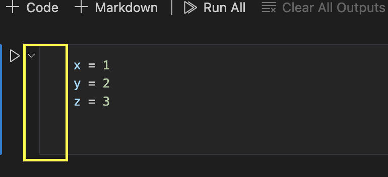
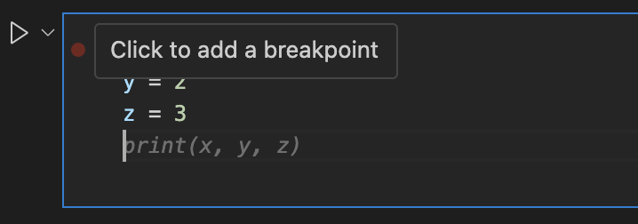
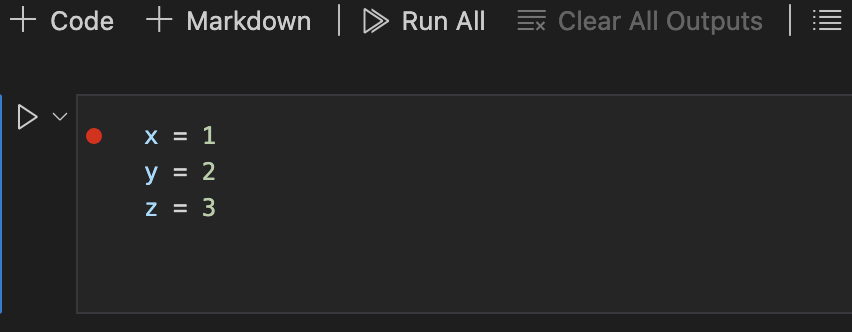
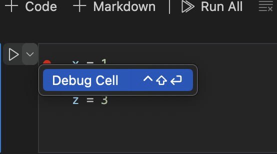
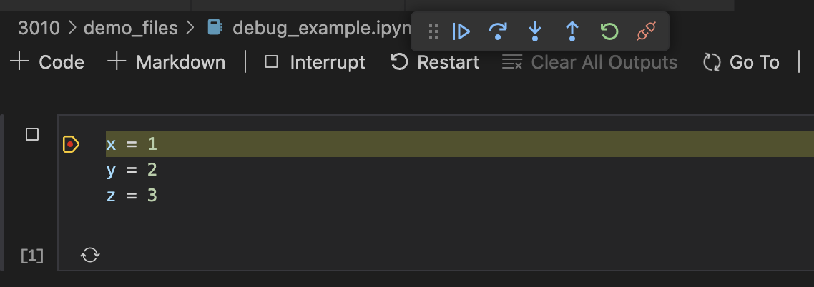
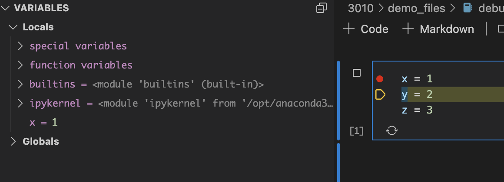
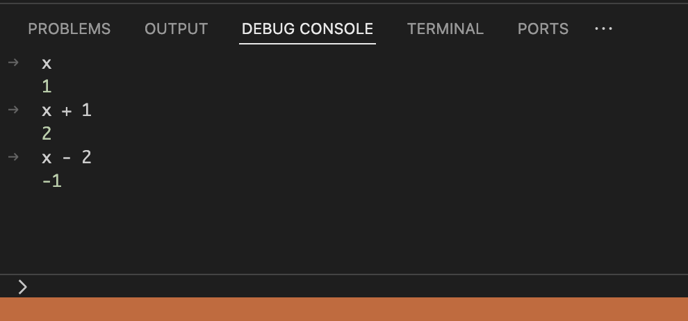

# Step 1

## Some Basic Concepts

### **What is a Computer?**

If you think about it, you computer is a magic rock (aren't we all?)! It's a rock that can do math, remember things, and even talk to other rocks!

Your computer is composed of two main components: Hardware and Software.

The hardware is the physical parts of the computer - the things you can touch and see. This includes things like the monitor, keyboard, mouse, and the computer itself.

The software is the programs that run on the computer. This includes things like the operating system (Windows, Mac OS, Linux), web browsers, and the programs you use to do things like write documents, create spreadsheets, and play games.

In order for software to operate, it needs to know where to find the data it needs to run. This is where the file system comes in.

The file system is the way that data is stored on your computer. Think of the filing system like addresses on a street. Each file on your computer has an address, and the file system is the way that the computer knows where to find the data it needs.

To further understand the basics of the file system, we need to know what a "directory" and a "file" are.

### **What is a "Directory"?**

A directory is a place where files are stored. Think of a directory like a folder on your computer (for all intents and purposes, directory == folder). A directory can contain other directories, as well as files.

Directories are important because this allows us to provide distinct and organized "addresses" for our files. Keeping files organized, particularly for programming projects, is very important for scalability, and reproducability.

!!! Tip "Scientific Programming"
    File cleanliness and organization is particularly important in scientific programming. This is because we often need to share our code with others, or come back to it after a long period of time. If our code is not organized, it can be very difficult for us - or anyone else! - to understand what is going on.

### **What is a "File" and "File Extension"?**

A file is a collection of data that is stored on your computer. Files can contain text, images, videos, or any other type of data. Files are stored in directories, and each file has a name that is unique within the directory.

Files can be combined to create applications - think "apps". Applications are made up of many files that work together to provide specific functions. Examples of applications include web browsers, word processors, and games.

A file extension is a series of characters that are added to the end of a file name to indicate what type of file it is. For example, a file with the extension " `.txt`" is a text file, while a file with the extension "`.jpg`" is an image file. File extensions are important because they tell the computer what type of data is in the file, and how to open it. 

I'm a huge fan of the `.md` file extension, which is a markdown file - it's a great, non-proprietary way to write and format text.

??? Tip "Markdown"
    Markdown is a lightweight markup language that you can use to format text. It is often used to write documentation, README files, and other types of text that need to be formatted. Markdown is easy to learn, and you can use it to create headings, lists, links, and other types of formatting. 

    You can learn more about Markdown [here](https://www.markdownguide.org/).


## Tools we'll be using throughout this learning path:

### **Google Colab**

Google Colab, or "Colab Notebooks" is a completely free tool that allows you to write and execute Python code in your web browser. It is a great tool for learning Python, as it allows you to write and run code without having to install anything on your computer. It is also a great tool for sharing code with others, as you can easily share a link to your notebook with others, and they can view and run your code without having to install anything on their computer.

For a lot of the work we will be doing in our class, we will be using Google Colab. You can access Google Colab [here](https://colab.research.google.com/), and assignments will often be shared with you as a link to a Google Colab notebook.

### **VSCode**

Visual Studio Code (very often referred to as "VSCode") is a free code editor that is available for Windows, Mac, and Linux. It built and supported by Microsoft, and is a very powerful tool that can be customized to fit your needs. For the purposes of our class, we will most often be using Google Colab, but having VSCode installed on your machine will enable you to work on your code locally - this will be an optional path that you can take if you want to work on your code outside of Google Colab!

You can download VSCode [here](https://code.visualstudio.com/).

> Note: You do not want to download Visual Studio, which is a different product. Make sure you are downloading **Visual Studio Code** (VSCode).


### **GitHub**

GitHub is a website that allows you to store and share your code with others. It is a great tool for collaborating on code with others, and for sharing your code with the world.

The primary reason I'd like us to have access to GitHub - in the long term - is the integration of VSCode with their AI tool, GitHub Copilot. In my testing, I've found that GitHub Copilot is one of the best available coding AI tools out there - and as students at UC (or any other University), you have access to it for free!

## Exercises
1. Install VSCode on your computer (follow the link above in the `VSCode` section). We wont use this immediately, but we'll use it later!
2. Open and walk through your first [Google Colab Notebook](https://colab.research.google.com/drive/1PM0hFyBbP6k9TjMW8kVIz9_i_w9n4hCQ?usp=sharing) to get a taste of programming in Python!.
    - In this excercise you will:
        - learn how to run code in a Google Colab Notebook.
        - run your first "Hello World" program using a Colab Cell.
        - learn about comments and why they're important, especially for scientific programming.
        - be introduced to the concept of "variables" in programming.

# Step 2

In step 2, we have two objectives:

1. Get familiar with the VSCode interface, including the file explorer, terminal, and editor.
2. Introduce ourselves to the building blocks of Python, including environments, libraries, syntax, and programming terminology.

## Exercise: Intro to VSCode

### **Visually navigating VSCode**

Visual Studio Code (VSCode) is a powerful code editor. If you didn't install it yet, go back to `Step 1` and follow the instructions.

Here's a quick overview of its main components:

- **Activity Bar**: Located on the far left, it lets you switch between views and gives you access to different features.
- **Side Bar**: Shows different views like the Explorer, Search, Source Control, etc.
- **Editor**: The main area where you edit your files.
- **Panel**: Located at the bottom, it shows output, terminal, problems, etc.
- **Status Bar**: Displays information about the opened project and the current file.

### **Open up a new terminal**

1. **Open the Terminal**: 

    - Go to the top menu and select `Terminal > New Terminal`.
    - In the future, you can use the shortcut that is shown near `New Terminal`. Shortcuts are great!
    - If you toggle open the pannel (using the pannel button in the top right corner of the terminal), you can also create a new terminal from there by pushing the big `+` button.

2. **Print your current directory path**:
Use the `pwd` command to print the path of your current directory:
     ```sh
     pwd
     ```
This will show you the path to your current directory, remember this is like the "address" of where you are in your computer. When we create files and folders (new directories!) we will be doing so in this location.

!!! Tip "Code Blocks"
    Above, you'll notice a gray box with text inside. This is a code block. You can copy the text inside the block with the "copy" button on the far right of the box, and paste it into your terminal to run the command.
    
3. **Get to know your directory structure in the terminal**:
Use the `ls` command to list the contents of your current directory:
     ```sh
     ls
     ```

4. **Create a new directory called `a_folder_is_a_directory`**:
Use the `mkdir` command:
     ```sh
     mkdir a_folder_is_a_directory
     ```
> `mkdir` stands for "make directory" and is used to create new directories (or, "folders").

5. **Create a new directory called `a_folder_is_a_directory/this_is_a_directory_within_a_directory`**:
Use the `mkdir` command again:
     ```sh
     mkdir a_folder_is_a_directory/this_is_a_directory_within_a_directory
     ```
> This creates a directory within a directory, also known as a subdirectory.

6. **Create a file called `test_1.md` in the `this_is_a_directory_within_a_directory` directory**:
Use the `New-Item` command:
     ```sh
     New-Item -Name "test_1.md" -ItemType File
     ```
> `New-Item` is a command that tells the computer we want to make a new file. `-Name` and `-ItemType` are both parameters that you need to feed the `New-Item` command in order for it to work. In this case, we feed each parameter an "argument" in the space after it is presented, where "test_1.md" is the argument for the parameter `-Name` that specifies the file name.
>
> By default, this will create the file in your current directory. You can add an input parameter called "`-Path`" if you want to create a file in a particular location, like this: -Path `"C:\Users\wirthtd\downloads"`  

### **Navigate to the `a_folder_is_a_directory` directory in the VSCode file explorer**

1. **Open the Explorer**:

You should be able to see the directory/folder structure in the file explorer on the left side of the VSCode window. If you can't see it:

- Click on the Explorer icon in the Activity Bar (double-page icon in the top left of VSCode) or use the shortcut: `Ctrl + Shift + E` (`Cmd + Shift + E` on Mac).


2. **Navigate to the directory**:

    - Click on the `a_folder_is_a_directory` folder to expand it.
    - Then, click on the `this_is_a_directory_within_a_directory`.
    > Note: because there is *only* one directory within `a_folder_is_a_directory`, the two directories might appear stacked on a single line. If we added more content to `a_folder_is_a_directory`, it would open up in a way that appears more "normal". There are settings to change this behavior, but we won't worry about that right now.

### **Open the `test_1.md` file in the VSCode editor**

1. **Open the file**:
   - Double-click on `test_1.md` to open it in the editor.
   - This is a markdown (`.md`) file, you can learn more about markdown [here](https://www.markdownguide.org/)

## Intro to Python

Python is a high-level, interpreted programming language known for its readability and versatility. It's widely used in various fields, including web development, data analysis, artificial intelligence, and scientific computing.

### **Python Environment**

A *Python environment* is a setup that includes the Python interpreter, libraries, and other tools necessary to run Python scripts. Understanding and setting up a Python environment is crucial for ensuring that your Python projects run smoothly and are well-organized.

#### Components of a Python Environment

1. **Python Interpreter**: The core component that reads and executes Python code, telling your hardware what to do.
2. **Libraries and Packages**: Collections of pre-written code that perform common tasks, such as NumPy for numerical operations and Pandas for data manipulation. Think of these as special-purpose tools that you can use to build your projects. We'll go over some examples of libraries further down.
3. **Virtual Environment**: A self-contained directory that includes a specific version of Python and a set of libraries. This helps isolate projects from each other, preventing conflicts between dependencies.

#### Benefits of Using a Python Environment

- **Isolation**: Each project can have its own dependencies, avoiding conflicts with other projects.
- **Reproducibility**: Ensures that the code runs consistently across different machines.
- **Organization**: Keeps projects clean and manageable.

Using Python Environments on a project-to-project basis is a good practice to get into early on, and it is a critical concept in scientific software development!
> Reflect: Why might this be important in scientific software development?

### Python "Libraries"

Python has a rich ecosystem of "libraries" that extend its capabilities - this is one of the greatest advantages of Python, and is a result of it being the largest free and open source programming language in the world. 

*Remember*, a library is a collection of pre-written code that performs common tasks. Libraries are a critical component of your Python environment.

Here are some Python Libraries that are particularly common in scientific computing:

#### [*NumPy*](https://numpy.org/)

NumPy is a library for numerical computing in Python. It provides support for arrays, matrices, and many mathematical functions.

#### [*Pandas*](https://pandas.pydata.org/)

Pandas is a library for data manipulation and analysis. It provides data structures like DataFrames, which are essential for handling structured data.

#### [*Matplotlib*](https://matplotlib.org/)

Matplotlib is a plotting library for creating static, animated, and interactive visualizations in Python.

### **Some more basic programming terminology**

#### *Syntax*

Syntax refers to the set of rules that define the structure of a programming language - in other words, *syntax tells you the necessary rules for writing code*. 

In Python, syntax is designed to be readable and straightforward.

#### *Variables*

Variables are used to store data that can be referenced and manipulated in a program. You got a taste of variables in Exercise 1.

In Python, you can create a variable by assigning a value to it:

```python
x = 10
```

## Exercise
Go to [this Google Colab Notebook](https://colab.research.google.com/drive/1YJDwmEiYFeDrfHM_-xMiwwymplbkpe3R?usp=sharing) and work through importing a Python library, and exploring some Python syntax & variables.

### Bonus

??? Tip "Setting Up a Python Environment"
     > This is a bit advanced - we'll do this together eventually, but if you want to play around with environment set up you should go ahead!!

     1. **Install Python**: Download and install Python [from the official website](https://www.python.org/downloads/).

     2. **Create a Virtual Environment**:

          - Open your terminal or command prompt.
          - Navigate to your project directory.
          - Run `python -m venv env` (where `env` is the name of your environment).

     3. **Activate the Virtual Environment**:

          - On Windows: `.\env\Scripts\activate`
          - On macOS/Linux: `source env/bin/activate`

     4. **Install Libraries**: Use `pip install <library_name>` to add necessary libraries.

     *Example*

     ```bash
     # Create a virtual environment
     python -m venv myenv

     # Activate the virtual environment
     source myenv/bin/activate  # On macOS/Linux
     .\myenv\Scripts\activate  # On Windows

     # Install a library
     pip install numpy
     ```

# Step 3

## Getting Python Set up in VS Code

> Note: If you haven't installed VSCode yet, go back to Step 1.

With VSCode installed, getting Python set up is fairly straight forward. 

- Open VSCode
- Click on the Extensions icon on the left side of the window (it looks like a square with a few smaller squares in it)
- Search for "Python" in the search bar
- Click the green "Install" button on the Python extension by Microsoft
- Once the extension is installed, click the green "Reload" button to activate the extension

## Jupyter Notebooks

You've already used a Jupyter Notebook without realizing it; all Google Colab Notebooks are Jupyter Notebooks! Jupyter Notebooks are a great way to write and run Python code in a more interactive way than a traditional script.

Jupyter compartments your code into "cells" that can be run independently of one another. This is great for debugging and testing code, as you can run a single cell to see if it works as expected.

There are many ways to create a new Jupyter Notebook file in VSCode, one of the easiest ways is to click `File > New File` and then either save the file with a `.ipynb` extension or `Jupyter Notebook` in the file type dropdown that pops up.

> Note: Any time you are prompted by VSCode to install a new package or extension relating to Python or Jupyter Notebooks, you should do so. These packages and extensions are what make Python and Jupyter Notebooks work in VSCode.

## Introduction to Python Data Types

Python has several built-in data types that are used to store different kinds of information. Here are some of the most common data types:

- **Integers**: Whole numbers, e.g., `1`, `42`, `-7`
- **Floats**: Decimal numbers, e.g., `3.14`, `0.001`, `-2.5`
- **Strings**: Text, e.g., `"hello"`, `"Python"`, `"123"`
- **Booleans**: True or False values, e.g., `True`, `False`

### Examples of Data Types

```python
# Integer
a = 10

# Float
b = 3.14

# String
c = "Hello, Python!"

# Boolean
d = True
```

## Variables in Python

Variables are used to store data that can be referenced and manipulated in a program. They act as containers for values.

### Variable Naming Conventions
- Variable names must start with a letter or an underscore (`_`), such as `_myVar` or `myVar`.
- The rest of the name can contain letters, numbers, or underscores, examples: `myVar`, `my_var`, `myVar123`.
- Variable names are case-sensitive (e.g., `myVar` and `myvar` are different).

!!! tip "Consistency is Key"
    When you start a project, try to pick a variable naming style and stick to that style throughout your code. This will make your code more readable and maintainable. There are a few styles commonly used in Python:

    - **Snake Case**: `my_variable_name` (**recommended for Python**, where all letters are lower case and spaces are replaced with underscores)
    - **Camel Case**: `myVariableName` (the first word is lowercase, and the subsequent words are capitalized, no spaces. This is commonly used in JavaScript and C#)
    - **Pascal Case**: `MyVariableName` (the first letter of each word is capitalized, no spaces. This is commonly used in C# and Java)

    If you choose to use something other than snake case for python, that's fine! But remember to be consistent.

### Assigning Values to Variables

You can assign values to variables using the assignment operator (`=`).

### Examples of Variable Assignments
```python
# Assigning values to variables
x = 5
y = 10.5
name = "Alice"
is_student = True
```

!!! Tip "Variable Reassignment"
    You can reassign a variable to a different value at any time. The new value can be of the same or a different data type - be careful when reassigning variables to avoid confusion!

### Type Checking

You can check the data type of a variable using the `type()` function.

```python
# Check the data type of a variable
x = 5
print(type(x))  # Output: <class 'int'>
```

If you run the code snippet above, you will see that the output is `<class 'int'>`, indicating that the variable `x` is an integer.
> Note: "class" here is a Python term that refers to the data type of the variable. Data classes are important, and we will learn more about them in the future.

Here are the different outputs for the different types we've covered in today's Path Step:

- `int` for integers
- `float` for floats
- `str` for strings
- `bool` for booleans

!!! Tip "Try it out!"
    Open up a new Collab Notebook and create a variable assigment. Then, in a subsequent cell, use the `type()` function to check the data type of the variable. Did it work the way you thought?

## Reflect

Why might there be different data types in programs? (Answer below)

??? Tip "Answer"
    There are a lot of reasons! But here are a few that I can come up with from the perspective of a scientific programmer:

    1. As scientists, we work with lots of different types of data - often at the same time. We might want to construct pipelines specifically designed for a particular data type; later on in our class we'll create functions. Some functions can be are type-specific, meaning they will only work if we supply that function with the correct data type. This is a good thing, because it means we can be sure that our functions are doing what we expect them to do.
    2. Different data types have different properties. For example, you can't add a string to an integer in the same way you can add two integers. This can be useful for controlling the flow of your program and ensuring that you're not doing something you didn't intend to do.
    3. Different properties allow you to control the flow of your program in different and nuanced ways. For example, you can use booleans to control whether or not a particular block of code is executed. This can be useful for debugging (fixing your code), or for ensuring that your code is running as expected - we will talk more about program flow in Step 5!
    

## Review

In this step, we learned about different data types in Python and how to work with variables. Understanding data types and variables is essential for writing code in Python. Here's a quick recap:

- **Data Types**: Python has several built-in data types, including integers, floats, strings, and booleans.
- **Variables**: Variables are used to store data in a program. They act as containers for values.
- **Variable Naming Conventions**: Follow naming conventions to make your code more readable and maintainable.
- **Type Checking**: You can check the data type of a variable using the `type()` function.

# Colab Exercise

Now that you've learned about data types and variables, it's time to practice! 

Open up [this Colab Notebook](https://colab.research.google.com/drive/1YVOsMUGVhWHfogyxWpdxous4Ne85Y7k0?usp=sharing) and work through the exercises to reinforce your understanding.

# Step 4

In Step 4, we will dive into operators and expressions in Python. Operators allow us to perform various operations on data, and expressions combine variables and operators to produce new values. Understanding these concepts is crucial for writing effective and efficient code.

## Operators in Python

Python provides several types of operators that you can use to perform different operations on data. Here are the main types of operators:

### Arithmetic Operators

Arithmetic operators are used to perform mathematical operations.

- **Addition (`+`)**: Adds two numbers.
- **Subtraction (`-`)**: Subtracts the second number from the first.
- **Multiplication (`*`)**: Multiplies two numbers.
- **Division (`/`)**: Divides the first number by the second.
- **Modulus (`%`)**: Returns the remainder of the division.
- **Exponentiation (`**`)**: Raises the first number to the power of the second.

#### Examples of Arithmetic Operators
> You can run any of these examples in an `.ipynb` inside of VSCode, or in a Colab notebook.
??? tip "What's an `.ipynb`?"
    An `.ipynb` file is a "Jupyter Notebook" file that allows you to run Python code in a cell-by-cell format. You've already been working with these in Google Colab! You can create a new `.ipynb` file in VSCode by clicking on the `New File` button in the file explorer and selecting `Python 3` as the kernel. If you want to try this out, go for it! Ask a chatbot or your professor if you get confused.

```python
# Addition
result = 5 + 3
print("5 + 3 =", result)

# Subtraction
result = 10 - 4
print("10 - 4 =", result)

# Multiplication
result = 7 * 2
print("7 * 2 =", result)

# Division
result = 15 / 3
print("15 / 3 =", result)

# Modulus
result = 10 % 3
print("10 % 3 =", result)

# Exponentiation
result = 2 ** 3
print("2 ** 3 =", result)
```

### Comparison Operators

Comparison operators are used to compare two values and return a boolean result (`True` or `False`).

- **Equal to (`==`)**: Checks if two values are equal.
- **Not equal to (`!=`)**: Checks if two values are not equal.
- **Greater than (`>`)**: Checks if the first value is greater than the second.
- **Less than (`<`)**: Checks if the first value is less than the second.
- **Greater than or equal to (`>=`)**: Checks if the first value is greater than or equal to the second.
- **Less than or equal to (`<=`)**: Checks if the first value is less than or equal to the second.

#### Examples of Comparison Operators
> You can run any of these examples in an `.ipynb` inside of VSCode, or in a Colab notebook.

```python
# Equal to
print(5 == 5)  # True

# Not equal to
print(5 != 3)  # True

# Greater than
print(7 > 4)  # True

# Less than
print(3 < 8)  # True

# Greater than or equal to
print(6 >= 6)  # True

# Less than or equal to
print(2 <= 5)  # True
```

### Logical Operators

Logical operators are used to combine conditional statements.

- **AND (`and`)**: Returns `True` if both statements are true.
- **OR (`or`)**: Returns `True` if at least one statement is true.
- **NOT (`not`)**: Reverses the result, returns `False` if the result is true.

#### Examples of Logical Operators
> You can run any of these examples in an `.ipynb` inside of VSCode, or in a Colab notebook.

```python
# AND
print(True and True)  # True
print(True and False)  # False

# OR
print(True or False)  # True
print(False or False)  # False

# NOT
print(not True)  # False
print(not False)  # True
```

## Expressions in Python

Expressions are combinations of variables, operators, and values that produce a result. They are the building blocks of any Python program.

### Combining Variables and Operators

You can combine variables and operators to create expressions. Here are some examples:
> You can run any of these examples in an `.ipynb` inside of VSCode, or in a Colab notebook.

```python
# Arithmetic expression
x = 5
y = 3
result = x + y
print("x + y =", result)

# Comparison expression
is_greater = x > y
print("x > y:", is_greater)

# Logical expression
is_true = (x > y) and (y > 0)
print("(x > y) and (y > 0):", is_true)
```
## Exercise: Working with Operators and Expressions

Now it's time to practice using operators and creating expressions. You can do this your own Colab Notebook, in an `.ipynb` file in VSCode, or in a Python file in VSCode (we haven't done this last one yet - if you'd like to try,ask a chatbot or your professor!).

Try the following exercises:

### Exercise 1: Arithmetic Operators

Write a Python program that performs the following operations and prints the results:

1. Add two numbers.
2. Subtract one number from another.
3. Multiply two numbers.
4. Divide one number by another.
5. Find the remainder of the division of two numbers.
6. Raise one number to the power of another.

### Exercise 2: Comparison Operators

Write a Python program that compares two numbers using each of the comparison operators and prints the results.

### Exercise 3: Logical Operators

Write a Python program that uses logical operators to combine multiple conditions and prints the results.

### Exercise 4: Creating Expressions

Write a Python program that combines variables and operators to create expressions. Use arithmetic, comparison, and logical operators in your expressions.

## Reflect

Think about the different types of operators and expressions you've learned. How might you use them in your own programs? What are some real-world scenarios where these concepts might be useful?

## Review

In this step, we learned about different types of operators and expressions in Python. Here's a quick recap:

- **Arithmetic Operators**: Used to perform mathematical operations.
- **Comparison Operators**: Used to compare two values and return a boolean result.
- **Logical Operators**: Used to combine conditional statements.
- **Expressions**: Combinations of variables, operators, and values that produce a result.

Understanding these concepts is essential for writing effective and efficient code in Python.

# Step 5

In Step 5, we will explore control structures in Python, specifically focusing on making decisions using conditional statements. Control structures allow us to control the flow of our programs, making them more dynamic and responsive to different inputs and conditions.

!!! Tip "Write as you Go"
    As you work through this step, try writing code snippets in your own Notebook either in VSCode or Google Colab. This will help you practice and reinforce what you're learning.

## Indentations in Python

Indentation is a crucial aspect of Python syntax. Unlike many other programming languages that use braces `{}` to define code blocks, Python uses indentation to determine the grouping of statements. This means that the level of indentation (spaces or tabs) is used to define the structure and flow of your code.

!!! Tip "How to make an indentation?"
    In VSCode and Google Colab, you can create an indentation by pressing the `Tab` key on your keyboard. You can also use the `Shift` + `Tab` key to remove/reverse an indentation.

    *Weirdly*, in Python, the "prefered" way to indent is to use 4 spaces. This is because it is easier to read and is more consistent across different editors and platforms - because typically, when you press `Tab`, it creates a character `\t`. HOWEVER, most IDEs like VSCode will automatically convert tabs to 4 spaces for you - for the purposes of this class, you should be fine to use the `Tab` key.

### Why Indentation Matters

Indentation is not just for readability; it is a *fundamental part* of Python's syntax (remember, "syntax" is a way of saying "the way the program is written to be understood by the machine"). Incorrect indentation can lead to syntax errors or unexpected behavior in your code.

### Rules for Indentation

1. **Consistent Indentation**: Use the same number of spaces or tabs for each level of indentation. Mixing spaces and tabs can cause errors. Most 
2. **Standard Practice**: The standard practice is to use 4 spaces for each level of indentation. Most Python editors and IDEs (like VSCode) are configured to use 4 spaces by default.
3. **Indentation Levels**: Each level of indentation represents a new block of code. For example, the code inside an `if` statement or a loop must be indented.

### Example

We will learn about `if` statements in the next section below, but here's an example to illustrate the importance of indentation. This might make more sense after you learn what an `if` statement is, but for now think of an `if` statement as a way to check if a condition is true or false.

```python
x = 10
if x > 5:
    print("x is greater than 5")
    if x > 8:
        print("x is also greater than 8")
print("This line is outside the if statement")
```

In this example:

- The first `print` statement is indented once, so it is part of the `if x > 5` block.
- The second `print` statement is indented twice, so it is part of the `if x > 8` block, which is nested inside the first `if` block.
- The final `print` statement is not indented, so it is outside of the `if` block and will always be executed.

So, remember to pay attention to your indentation when writing Python code! It changes the way the code will be executed. Now, onto more fun things!

## Conditional Statements

Conditional statements are used to perform different actions based on different conditions. The most common conditional statements in Python are `if`, `elif`, and `else`.

### The `if` Statement

The `if` statement is used to test a condition. If the condition is true, the code block inside the `if` statement is executed.

!!! Tip "Recall: Boolean Operators"
    Remember that conditional statements rely on boolean expressions to determine whether a condition is true or false. We went over boolean operators in Step 4, but here's a quick refresher:
    
    A boolean expression is an expression that evaluates to either `True` or `False`. We can make the variable `condition` in the `if` statement is a boolean expression by setting it equal to to either `True` or `False` before we run the code. You can experiment with this in your own Notebook, printing out a value within the conditional statement to see how it changes.

#### Syntax

```python
if condition:
    # code block to be executed if the condition is true
```

#### Example

```python
x = 10
if x > 5:
    print("x is greater than 5")
```

### The `elif` Statement

The `elif` statement is short for "else if". It allows us to check multiple conditions.

#### Syntax

```python
if condition1:
    # code block to be executed if condition1 is true
elif condition2:
    # code block to be executed if condition2 is true
```

#### Example

```python
x = 10
if x > 15:
    print("x is greater than 15")
elif x > 5:
    print("x is greater than 5 but less than or equal to 15")
```

### The `else` Statement

The `else` statement catches anything that isn't caught by the preceding conditions.

#### Syntax

```python
if condition1:
    # code block to be executed if condition1 is true
elif condition2:
    # code block to be executed if condition2 is true
else:
    # code block to be executed if none of the conditions are true
```

#### Example

```python
x = 10
if x > 15:
    print("x is greater than 15")
elif x > 5:
    print("x is greater than 5 but less than or equal to 15")
else:
    print("x is 5 or less")
```

!!! Tip "Play with it!"
    In a notebook, copy and paste the code above. Then try changing the value of `x` in the example above to see how the output changes based on the conditions.

## Exercise: Making Decisions with Conditional Statements

Now it's time to practice using conditional statements. You can do this in your own Colab Notebook, in an `.ipynb` file in VSCode, or in a Python file in VSCode.

### Exercise 1: Basic `if` Statement

Write a Python program that checks if a number is positive, negative, or zero and prints the result.

??? Tip "Solution"

    Here's a simple solution to the basic `if` statement problem:

    ```python
    x = 10
    if x > 0:
        print("x is positive")
    elif x < 0:
        print("x is negative")
    else:
        print("x is zero")
    ```

### Exercise 2: Using `elif` and `else`

Write a Python program that checks the grade of a student based on their score and prints the corresponding grade (A, B, C, D, or F).

??? Tip "Solution"

    Here's a simple solution to the grade-checking problem:

    ```python
    score = 85
    if score >= 90:
        print("A")
    elif score >= 80:
        print("B")
    elif score >= 70:
        print("C")
    elif score >= 60:
        print("D")
    else:
        print("F")
    ```

## Reflect

Think about how conditional statements can be used to control the flow of a program. What are some real-world scenarios where these concepts might be useful?

??? Tip "Sorting Data"
    Conditional statements can be used to sort data, filter out unwanted information, or make decisions based on specific criteria. For example, you might use conditional statements to categorize products based on their price, filter out invalid user inputs, or determine the eligibility of a customer for a discount.

## Review

In this step, we learned about conditional statements in Python. Here's a quick recap:

- **`if` Statement**: Used to test a condition and execute a code block if the condition is true.
- **`elif` Statement**: Allows us to check multiple conditions.
- **`else` Statement**: Catches anything that isn't caught by the preceding conditions.

Understanding these concepts is essential for writing dynamic and responsive programs in Python.

# Step 6

In Step 6, we will focus on problem-solving using control structures. This step will build on the concepts of conditional statements and introduce loops, which are essential for creating dynamic and efficient programs.

## Problem-Solving with Control Structures

Control structures allow us to control the flow of our programs, making them more dynamic and responsive to different inputs and conditions. In this step, we will explore how to use control structures to solve problems.

### Loops in Python

Loops are used to execute a block of code repeatedly. Python provides two types of loops: `for` loops and `while` loops.

### The `for` Loop

The `for` loop is used to iterate over a sequence of numbers and execute a block of code for each number.

!!! Tip "`list`s in Python"
    A `list` is a collection of items that can be of different types. You can create a list by placing the items inside square brackets `[]`, separated by commas. For example:

    ```python
    numbers_list = [1, 2, 3, 4, 5]
    ```

    Lists are iterable, meaning you can loop over the items in a list using a `for` loop. Python makes great use of lists and other iterable objects to simplify programming tasks!

#### Syntax

```python
numbers_list = [1, 2, 3, 4, 5]

for number in numbers_list:
    # code block to be executed for each number in the list
```
#### Example

```python
numbers_list = [1, 2, 3, 4, 5]
for number in numbers_list:
    print(number)
```

??? Tip "The `range()` Function"
    The `range()` function is commonly used with `for` loops to generate a sequence of numbers. It takes three arguments: `start`, `stop`, and `step`. For example, `range(1, 6, 2)` generates the sequence `1, 3, 5`.

    You can also use `range()` with a single argument to generate a sequence starting from 0. For example, `range(5)` generates the sequence `0, 1, 2, 3, 4`. 

    You can use the `range()` function to iterate over a specific range of numbers in a `for` loop, like this: 

    ```python
    for i in range(1, 6):
        print(i)
    ```

#### Another Example

Just like you can loop over a list of numbers, you can loop over a string in Python. When you feed in a string to a `for` loop, it will iterate over each character in the string.

```python
for character in "This will print vertically":
    print(character)
```

### The `while` Loop

The `while` loop is used to execute a block of code as long as a condition is true.

#### Syntax

```python
while condition:
    # code block to be executed as long as the condition is true
```

#### Example

```python
count = 0
while count < 3:
    print(count)
    count += 1
```

!!! Tip "The `+=` Operator"
    The `+=` operator is used to increment (add) the value of a variable. This is a shorter way to write 
    ```python
    variable = variable + 1
    ```
    
    `-=` can be used to decrement (subtract) the value of a variable, as well as `*=`, `/=`, and `**=` for multiplication, division, and exponentiation, respectively.

### Combining Loops and Conditional Statements

You can combine loops and conditional statements to create more complex control structures.

#### Example

```python
numbers_list = [1, 2, 3, 4, 5, 6, 7, 8, 9, 10]
for i in numbers_list:
    if i % 2 == 0:
        print(f"{i} is even")
    else:
        print(f"{i} is odd")
```

## Exercise: Problem-Solving with Control Structures

Now it's time to practice using loops and conditional statements to solve problems. You can do this in your own Colab Notebook, in an `.ipynb` file in VSCode, or in a Python file in VSCode.

### Exercise 1: Simple Loops

Write a Python program that prints the numbers from 1 to 5 using a `for` loop, then do it again for a `while` loop.

??? Tip "Solution"
    Here's a simple solution to the simple loops problem:
    
    ```python
    # Using a for loop
    numbers_list = [1, 2, 3, 4, 5]
    for i in numbers_list:
        print(i)
    ```

    ```python
    # Using a while loop
    count = 1
    while count < 6:
        print(count)
        count += 1
    ```

### Exercise 2: Sum of Numbers

Write a Python program that calculates the sum of numbers from 1 to 10.

??? Tip "Hint"
    You can use a `for` loop combined with the `range()` function to iterate over the numbers from 1 to 10 and calculate the sum. You could also implement the `+=` operator to increment the sum for each number.

??? Tip "Solution"
    Here's a simple solution to the sum of numbers problem:
    
    ```python
    total = 0
    for i in range(1, 11):
        total += i
    print(f"The sum of numbers from 1 to 10 is: {total}")
    ```

### Exercise 3: FizzBuzz

Write a Python program that prints the numbers from 1 to 20. For multiples of three, print "Fizz" instead of the number, and for the multiples of five, print "Buzz". For numbers which are multiples of both three and five, print "FizzBuzz".

??? Tip "Solution"
    Here's a simple solution to the FizzBuzz problem:
    
    ```python
    for i in range(1, 21):
        if i % 3 == 0 and i % 5 == 0:
            print("FizzBuzz")
        elif i % 3 == 0:
            print("Fizz")
        elif i % 5 == 0:
            print("Buzz")
        else:
            print(i)
    ```
### Exercise 4: Counting Vowels

Write a Python program that counts the number of vowels in a given string.

??? Tip "Hint" 
    You can use a for loop to iterate over each character in the string and a conditional statement to check if the character is a vowel.

??? Tip "Solution" 
    Here is one solution to the problem:
    ```python
    string = "This is a sample string"
    vowels = "aeiouAEIOU"
    count = 0
    for char in string:
        if char in vowels:
            count += 1
    print(f"The number of vowels in the string is: {count}")
    ```

### Exercise 5: Reverse a String

Write a Python program that reverses a given string using a for loop.

??? Tip "Hint" 
    You can use a for loop to iterate over the string in reverse order and build a new string.

??? Tip "Solution" 
    Here's a possible solution:
    ```python
    string = "Hello, World!"
    reversed_string = ""
    for char in string:
        reversed_string = char + reversed_string
    print(f"The reversed string is: {reversed_string}")
    ```

    *Think*: Why does this solution work?

### Exercise 6: Multiplication Table with F-Strings

Write a Python program that generates a multiplication table for numbers 1-5, using f-strings.

??? Tip "Hint" 
    You can use nested `for` loops to generate the multiplication table for numbers 1-5.

??? Tip "Solution"
    Here's a possible solution:
    ```python
    for i in range(1, 6):
        for j in range(1, 6):
            print(f"{i} x {j} = {i * j}") # Print a new line after each row
    ```

    This solution uses nested `for` loops to generate the multiplication table for numbers 1-5. The outer loop iterates over the numbers 1-5 for the first multiplier, and the inner loop iterates over the numbers 1-5 again for the second number, generating a table of all multiplication results.

## Reflect

Think about how loops and conditional statements can be used to solve problems. What are some real-world scenarios where these concepts might be useful?

??? Tip "Automating Repetitive Tasks"
    Loops and conditional statements are essential for automating repetitive tasks and handling different conditions in programs. For example, you can use loops to process large datasets, iterate over files in a directory, or perform calculations based on specific conditions. Conditional statements can be used to control the flow of a program, handle user inputs, or make decisions based on certain criteria.

    Another tool, `functions`, can also be used to automate repetitive tasks. We'll learn about functions in the next step!

## Review

In this step, we learned about loops and how to use them in combination with conditional statements to solve problems. Here's a quick recap:

- **`for` Loop**: Used to iterate over a sequence of numbers and execute a block of code for each number.
- **`while` Loop**: Used to execute a block of code as long as a condition is true.
- **Combining Loops and Conditional Statements**: Allows for more complex control structures and problem-solving.

Understanding these concepts is essential for writing dynamic and efficient programs in Python.

# Step 7

In Step 7, we will explore functions in Python. Functions are reusable blocks of code that perform a specific task. They help us organize our code, make it more readable, and avoid repetition.

## Defining Functions

To define a function in Python, we use the `def` keyword (short for "define") followed by the function name and parentheses `()`. 

Inside the parentheses, we can specify parameters, or "inputs", that the function can accept. The function body is indented and contains the code that will be executed when the function is called.

### Syntax

```python
def function_name(parameters):
    # code block to be executed
```

### Example

```python
def greet(name):
    print(f"Hello, {name}!")
```

In this example, `greet` is the function name, and `name` is a parameter. The function prints a greeting message using the provided name.

## Calling Functions

To call a function, we use the function name followed by parentheses `()`. If the function accepts parameters, we pass the arguments inside the parentheses.

### Example

```python
greet("Alice")
```

This will output:

``` 
Hello, Alice!
```


## Return Statement

Functions can return a value using the `return` statement. This allows us to capture the result of a function and use it in other parts of our code.

### Example

```python
def add(a, b):
    return a + b

result = add(3, 5)
print(result)
```

This will output:

```
8
```

## Default Parameters

We can define default values for parameters in a function. If an argument is not provided when the function is called, the default value will be used.

### Example

```python
def greet(name="World"):
    print(f"Hello, {name}!")

greet()
```

This will output:

```
Hello, World!
```

by default, the function uses "World" as the name. If we call the function without providing a name, it will use the default value, like this:

```python
def greet(name="World"):
    print(f"Hello, {name}!")

greet("Alice")

```

This will output:

``` 
Hello, Alice!
```

Try it yourself!


## Keyword Arguments

We can more flexibly use functions by telling the function what we want to use as input when we call that function.

Let's imagine a scenario where we have a "describe_pet" function that takes two parameters: "animal_type" and "pet_name", the function might look like this:

```python
def describe_pet(animal_type, pet_name):
    print(f"I have a {animal_type} named {pet_name}.")
```

We can specify the inputs, or "arguments", when we call the function by setting them equal to the parameter names. 

!!! Tip "Parameters & Arguments"
    The parameter is the name we give to the input in the function definition, and the argument is the actual value we pass to the function.

Here is an example of specifying that I have a dog named Rufus:
```python

describe_pet(animal_type="dog", pet_name="Rufus")
```

Note that when I specify the arguments (inputs), I can change the order and the function will work just fine:

```python
describe_pet(pet_name="Django", animal_type="dog")
```

So, in the code below, I can define the function and use the function twice in a row, changing the order of the arguments:

```python
def describe_pet(animal_type, pet_name):
    print(f"I have a {animal_type} named {pet_name}.")

describe_pet(animal_type="dog", pet_name="Sherlock")
describe_pet(pet_name="Watson", animal_type="cat")
```

This will output:

```
I have a dog named Sherlock. I have a cat named Watson.
```


## Exercises

1. **Define a Function**: Write a function called `square` that takes a number as a parameter and returns its square.

    ??? Tip "Solution"
        ```python
        def square(number):
            return number * number

        result = square(5)
        print(result)
        ```

2. **Call a Function**: Write a function called `multiply` that takes two numbers as parameters and returns their product. Call the function with different arguments and print the results.

    ??? Tip "Solution"
        ```python
        def multiply(a, b):
            return a * b

        result1 = multiply(3, 4)
        result2 = multiply(5, 2)
        print(result1)
        print(result2)
        ```

3. **Default Parameters**: Write a function called `greet_user` that takes a name as a parameter and prints a greeting message. If no name is provided, it should use "User" as the default name.

    ??? Tip "Solution"
        ```python
        def greet_user(name="User"):
            print(f"Hello, {name}!")

        greet_user("Alice")
        greet_user()
        ```

4. **Keyword Arguments**: Write a function called `make_sandwich` that takes a list of ingredients and prints a message describing the sandwich. Call the function using keyword arguments to specify the ingredients in different orders.

    ??? Tip "Solution"
        ```python
        def make_sandwich(ingredients):
            print("Sandwich with:")
            for ingredient in ingredients:
                print(f"- {ingredient}")

        make_sandwich(ingredients=["bread", "cheese", "tomato"])
        make_sandwich(ingredients=["tomato", "bread", "cheese"])
        ```

## Reflect

Think about how functions can help you organize your code and make it more reusable. What are some real-world scenarios where you might use functions?

## Review

In this step, we learned about functions in Python. Here's a quick recap:

- **Defining Functions**: Use the `def` keyword to define a function.
- **Calling Functions**: Use the function name followed by parentheses to call a function.
- **Return Statement**: Use the `return` statement to return a value from a function.
- **Default Parameters**: Define default values for parameters in a function.
- **Keyword Arguments**: Specify arguments using parameter names when calling a function.

Understanding these concepts is essential for writing organized and reusable code in Python.

# Step 8

In Step 8, we will reinforce our understanding of functions by combining them with loops, conditionals, and type hints. This step will provide opportunities to practice and see how these concepts work together.

## Simple Function

Let's start with a simple function that adds two numbers.

```python
def add(a, b):
    return a + b

result = add(3, 5)
print(result)
```

In this example, `add` is a function that takes two parameters `a` and `b`, and returns their sum.

## Using a Function in a Loop

Now, let's see how we can use this function in a loop to add numbers from a list.

```python
def add(a, b):
    return a + b

numbers = [1, 2, 3, 4, 5]
total = 0
for number in numbers:
    total = add(total, number)

print(total)
```

In this example, we use the `add` function in a `for` loop to sum all the numbers in the list.

## Functions with Various Data Types

Functions can work with different data types and return various outputs. Let's see some examples.

### Example 1: Concatenating Strings

```python
def concatenate(str1, str2):
    return str1 + " " + str2

result = concatenate("Hello", "World")
print(result)
```

### Example 2: Checking Even or Odd

```python
def is_even(number):
    if number == 0:
        return False # Zero is not considered even or odd, it is an "edge case"
                     # so we'll take care of it first.
    else:
        return number % 2 == 0 # Now that zero is taken care of, 
                               # this will work fine.

result = is_even(4)
print(result)
```

### Example 3: Finding the Maximum Value

```python
def find_max(a, b):
    if a > b:
        return a
    else:
        return b

result = find_max(10, 20)
print(result)
```

## Introducing Type Hints

Type hints allow you to specify the expected data types of function parameters and return values. They do not enforce the types but provide useful information for code readability. 

### Syntax

Below is a template for how a functino with type hints would work, note, these are not real types:

```python
def function_name(parameter: type) -> return_type:
    # code block
```

??? Tip "Why Type Hints are Important"

    Type hints improve code readability and help others understand what types of arguments a function expects and what it returns. They also assist in catching type-related errors during development.

Note, we are not changing anything about the function here. All we're doing is being *more communicative* about how the function should be used.

Below are some examples of functions with type hints.

#### Example 1: Adding Integers

```python
def add(a: int, b: int) -> int:
    return a + b

result = add(3, 5)
print(result)
```

This function is pretty simple, it takes two integers, adds them together, and returns an integer.

#### Example 2: Concatenating Strings

```python
def concatenate(str1: str, str2: str) -> str:
    return str1 + " " + str2

result = concatenate("Hello", "World")
print(result)
```

"Concatenate" means to join two things together. In this case, two strings.

This function takes two strings and returns a new string that is the concatenation of the two input strings.

??? Tip "String Concatenation"

    [You can follow this link](https://www.w3schools.com/python/python_strings_concatenate.asp) to see more about string concatenation in Python.

#### Example 3: Checking Even or Odd

```python
def is_even(number: int) -> bool:
    if number == 0:
        return False 
    else:
        return number % 2 == 0

result = is_even(4)
print(result)

```
Note, we used this function before, all we've changes is that we now have type hints!

### What when we feed a function the wrong type?

```python
def add(a: int, b: int) -> int:
    return a + b

result = add("3", 5)  # This will produce an error...
```

This will raise a `TypeError` because we are trying to add a string and an integer, which is not allowed based on the type hints. In this case, it will also functionally break the code.

The type error will look like this:
```
TypeError: can only concatenate str (not "int") to str
```

Note, if you fed the `add()` function a *float*, even though it breaks the Type Hint, the code will still run. This is because Python is a "dynamically typed language", and it will try to do the operation you're asking it to do and only break if it can't.

So, Type Hints are not a "hard rule" in Python, but they are a great idea to follow because **code is read more often than it is written**.

## Using a Loop within a Function

You can use loops within functions to perform repetitive tasks.

### Example: Summing Numbers

```python
def sum_numbers(n: int) -> int:
    total = 0
    for i in range(1, n + 1):
        total += i
    return total

result = sum_numbers(10)
print(result)
```

The example above takes in an integer `n` and returns the sum of all numbers from 1 to `n`. It uses the range function to generate a sequence of numbers from 1 to `n` - remember that range doesn't include the last number, so we add 1 to `n` + 1 so that we include `n` in the sum.

## Combining Functions with Conditionals

You can combine functions with conditionals to perform different actions based on conditions.

### Example: Filtering Even Numbers

> NOTE: For the function below, `is_even` is a function that we defined earlier in this document. That means if you've run the `is_even` function in your `.ipynb` already, then this code will work just fine. If you haven't, you'll need to run the code block containing `is_even` function before you run this code.

```python
def filter_even(numbers: list[int]) -> list[int]:
    even_numbers = []
    for number in numbers:
        if is_even(number):
            even_numbers.append(number)
    return even_numbers

numbers = [1, 2, 3, 4, 5, 6, 7, 8, 9, 10]
result = filter_even(numbers)
print(result)
```

This above function is great! It contains a loop that iterates over a list of numbers and uses the `is_even` function to check if each number is even. If the number is even (here, we use a conditional!), it is added to a new list called `even_numbers`, which is then returned.

This function combines a lot of what we've learned so far!

## Review

In this step, we reinforced our understanding of functions by exploring:

- **Simple Function**: Creating and using a basic function.
- **Using a Function in a Loop**: Applying a function within a loop.
- **Functions with Various Data Types**: Working with different data types and return values.
- **Introducing Type Hints**: Specifying expected data types for function parameters and return values.
- **Using a Loop within a Function**: Performing repetitive tasks within a function.
- **Combining Functions with Conditionals**: Using conditionals within functions to perform different actions.

Understanding these concepts is essential for writing robust and flexible code in Python.

## Exercises

> Rememeber: The solutions I provide are only one way to solve the problem. There are many ways to solve most coding problems! You should feel free to experiment and try different approaches.

1. **Type Hints**: Write a function called `concat` that takes two strings as parameters and returns their concatenation. Use type hints to specify the parameter and return types.

    ??? Tip "Solution"
        ```python
        def concat(str1: str, str2: str) -> str:
            return str1 + " " + str2

        result = concat("Hello", "World")
        print(result)
        ```

2. **Sum of Squares**: Write a function called `sum_of_squares` that takes an integer `n` and returns the sum of the squares of all numbers from 1 to `n`.

    ??? Tip "Solution"
        ```python
        def sum_of_squares(n: int) -> int:
            total = 0
            for i in range(1, n + 1):
                total += i ** 2
            return total

        result = sum_of_squares(5)
        print(result)
        ```

3. **Count Vowels**: Write a function called `count_vowels` that takes a string as a parameter and returns the number of vowels in the string. Use a loop to iterate over the string and count the vowels.

    ??? Tip "Solution"

        ```python
        def count_vowels(s: str) -> int:
            vowels = "aeiouAEIOU"
            count = 0
            for char in s:
                if char in vowels:
                    count += 1
            return count

        result = count_vowels("Hello, World!")
        print(result)
        ```

4. **Find Minimum**: Write a function called `find_min` that takes a list of integers and returns the smallest number in the list. Use a loop to iterate over the list and find the minimum value.


    ??? Tip "Solution"
        ```python
        def find_min(numbers: list[int]) -> int:
            min_number = numbers[0]
            for number in numbers:
                if number < min_number:
                    min_number = number
            return min_number

        numbers = [5, 3, 8, 1, 9, 2]
        result = find_min(numbers)
        print(result)
        ```

5. **Palindrome Check**: Write a function called `is_palindrome` that takes a string and returns `True` if the string is a palindrome (reads the same forwards and backwards) and `False` otherwise. Use a loop to check the characters.

    ??? Tip "Solution"

        ```python
        def is_palindrome(input_string: str) -> bool:
            input_string = input_string.lower() # This line makes it so we don't have to worry about capital letters.
            reversed_input_string = input_string[::-1]
            return input_string == reversed_input_string

        result1 = is_palindrome("radar")
        result2 = is_palindrome("hello")
        print(result1)
        print(result2)
        ```

## Bonus: Lambda Functions (One-Line Functions)

Lambda functions are small functions defined using the `lambda` keyword. They are often used for short, simple operations.

These are called "anonymous functions" because they don't have a name, we don't define ("`def`") them. They are useful when you need a simple function for a short period of time.

### Syntax

Note, the text below is a template, not real code:
```python
lambda parameters: expression
```

### Example: Squaring a Number

```python
square = lambda x: x * x
print(square(5))
```

### Example: Using Lambda with `filter`

```python
numbers = [1, 2, 3, 4, 5, 6, 7, 8, 9, 10]
even_numbers = list(filter(lambda x: x % 2 == 0, numbers))
print(even_numbers)
```
of course, the above code has the 0 edge case... but hopefully this gives you an idea.

## Bonus Excercise: Using Lambda Functions

1. **Filtering Odd Numbers**: Use a lambda function with the `filter` function to filter out odd numbers from a list of integers.

    ??? Tip "Solution"

        ```python
        numbers = [1, 2, 3, 4, 5, 6, 7, 8, 9, 10]
        odd_numbers = list(filter(lambda x: x % 2 != 0, numbers))
        print(odd_numbers)
        ```

2. **Adding "1"**: With a super simple lambda function, add 1 to a number.

    ??? Tip "Solution"

        ```python
        add_one = lambda x: x + 1
        print(add_one(5))
        ```

# Step 9

In Step 9, we will focus on debugging Python code using Visual Studio Code (VSCode) and Jupyter Notebooks (`.ipynb` files). Debugging is an essential skill for any programmer, as it helps identify and fix errors in the code.

> Note: This is the kind of thing that it really helps to watch someone demonstrate what debugging looks like. I've done my best to include images, but attending class and asking questions is uniquely important for this Step.

## Introduction to Debugging

Debugging is the process of finding and fixing errors or "bugs" in your code. Bugs can be syntax errors, runtime errors, or logical errors. Understanding how to debug effectively will save you time and frustration.

??? Tip "Why "bug"?"
    The term "bug" originated in the early days of computing when an actual insect (a moth) caused a malfunction in a computer. Since then, the term has been used to describe any unexpected behavior in software.

### Types of Errors

1. **Syntax Errors**: These occur when the code is not written correctly according to the language's rules. For example, missing a colon at the end of an `if` statement (Trent does this all the time...).
2. **Runtime Errors**: These occur when the code is executed and something goes wrong, such as dividing by zero.
3. **Logical Errors**: These occur when the code runs without crashing - in other words, telling you that something is wrong - but produces incorrect results. These are often the hardest to find.

## Debugging in VSCode

VSCode provides powerful tools for debugging Python code, including support for Jupyter Notebooks. Here are the steps to debug a `.ipynb` file in VSCode.

### Setting Up the Debugger

1. **Open VSCode**: Make sure you have VSCode installed and open it.
2. **Install Python Extension**: If you haven't already, install the Python extension for VSCode.
3. **Open Your Notebook**: Open the `.ipynb` file you want to debug.

### Using Breakpoints

Breakpoints allow you to pause the execution of your code at specific lines, so you can inspect the state of your program.

1. **Set a Breakpoint**: Click in the gutter (the space to the left of the line numbers) next to the line where you want to set a breakpoint. A red dot will appear.

    - The "Gutter" is the region to the left of the line numbers in the editor.
    

    - Hover your mouse over the gutter to see the breakpoint icon.
    

    - Click the dimmed breakpoint icon to set a breakpoint.
    

    - Click the down arrow near the play button for the cell, and you will see the option to "Debug Cell"
    

    - When you see the line highlighted in yellow, you have successfully set a breakpoint and you're now in debug mode!
    

2. **Start Debugging**: Now, you can walk through your code line by line. You can use the buttons in the debug toolbar to continue, step into, over, out, restart, or disconnect the debugger (symbols from left to right in image above).

    - The "Continue" button will run the code until the next breakpoint.
    - The "Step Over" button will run the next line of code.
    - The "Step Into" button will go into the next function call.
    - The "Step Out" button will run until the current function returns.
    - The "Restart" button will restart the debugger.
    - The "Disconnect" button will stop the debugger.

3. **Inspect Variables**: When the code execution pauses at a breakpoint, you can hover over variables to see their current values or use the Variables pane to inspect them.

    - To the left of the notebook, you will see the "Variables" tab. Click on it to see the variables in the current scope.
    - Note: in a Jupyter Notebook, the first time you run through the cell, your variables wont be identified yet, but they will be after the first run through. This means that if your code relies on a variable that is defined in a specific sequence, you'll need to restart the kernel and run the cell again.
    

    - You can also check variables and test code in the debug console (located at the bottom of VSCode). This is a great and useful way to test code without having to run the entire cell again or update your notebook.
    

### Reading Error Outputs

When an error occurs, VSCode will display an error message in the terminal or output pane. Understanding these messages is crucial for debugging.

1. **Error Message**: The error message will tell you what went wrong and where it happened. For example, `ZeroDivisionError: division by zero` indicates that you tried to divide a number by zero.
2. **Traceback**: The traceback shows the sequence of function calls that led to the error. This can help you pinpoint where the error occurred in your code.

## Exercises

Now, let's practice debugging with some exercises. Each exercise contains code with intentional errors. Your task is to find and fix the errors.

### Exercise 1: Syntax Error
Goal: Find and fix the syntax error.

```python
def greet(name)
    print(f"Hello, {name}!")
    
greet("Alice")
```

??? Tip "Hint" 
    Look for missing punctuation.

### Exercise 2: Runtime Error
Goal: Read and understand the error.

```python
def divide(a, b):
    return a / b

result = divide(10, 0)
print(result)
```

??? Tip "Hint" 
    Think about what happens when you divide by zero.

### Exercise 3: Logical Error
Goal: Fix the logical error in the code.

```python
def is_even(number):
    return number % 2 == 1

result = is_even(4)
print(f"Is 4 even? {result}")
```

??? Tip "Hint" 
    This code functions, but isn't working properly. 

    Check the logic used to determine if a number is even - does this make sense?

### Exercise 4: Using Breakpoints
Goal: Practice setting breakpoints and inspecting variables.

```python
def sum_list(numbers):
    total = 0
    for number in numbers:
        total += number
    return total

numbers = [1, 2, 3, 4, 5]
result = sum_list(numbers)
print(f"The sum of the list is: {result}")
```

??? Tip "Hint"
    Set a breakpoint inside the loop and inspect the value of `total` at each iteration.

    You've likely funtionally done this with print statements before, but this is a more efficient and less permanent way to do it.

### Exercise 5: Reading Error Outputs
Goal: Read, understand, and fix the (new) error.

```python
def get_item(lst, index):
    return lst[index]

my_list = [1, 2, 3]
result = get_item(my_list, 5)
print(result)
```

??? Tip "Hint" 
    Carefully read the error message and traceback to understand what went wrong. If you don't understand the error, try asking Microsoft Copilot what the error means :) If that doesn't help, ask the professor!

## Reflect

Think about how debugging can help you understand your code better and improve your problem-solving skills. What strategies can you use to debug more effectively?

## Review

In this step, we learned about:

- Different types of errors: syntax, runtime, and logical errors.
- Setting up the debugger in VSCode.
- Using breakpoints to pause code execution and inspect variables.
- Reading and understanding error outputs.

Understanding these concepts is essential for becoming a proficient programmer and writing reliable code.


# Step 10: OOP - Introduction to Classes and Objects

Welcome to Step 10, where we take a significant conceptual leap into **Object-Oriented Programming (OOP)**. So far, you've been learning how to write Python code using variables, functions, loops, and control structures. Now, we will explore a new way of organizing and structuring your code: by using **classes** and **objects**.

## What is Object-Oriented Programming (OOP)?

Object-Oriented Programming (OOP) is a programming paradigm (a style or way of programming) based on the concept of "objects." An **object** is an instance of a **class**, and a class defines the blueprint for that object.

OOP focuses on using **objects** that have both **data** (also called attributes) and **behaviors** (also called methods). This is different from procedural programming, where you write sequences of instructions for the computer to follow.

!!! Tip "What is an instance?"
    An instance is an individual object created from a class. When you define a class, you're creating a blueprint, but when you create an instance, you're making an actual object based on that blueprint.

    Instancing also happens when you define a variable, or a function. So when you assign a namespace to a class, you're creating an instance of that class.


### Why OOP?

OOP allows us to:

- **Model real-world entities**: You can represent things like students, books, or even psychology experiments as objects in your code.
- **Organize and reuse code**: Classes let us write modular and reusable code. Once you write a class, you can create multiple objects from it, each with its own unique data.
- **Structure complex systems**: As projects grow larger, OOP makes it easier to manage and structure the code.

## The Key Concepts of OOP

There are four fundamental concepts in OOP:

1. **Classes**: A blueprint for creating objects. It defines a set of attributes and methods that the objects created from the class will have.
2. **Objects**: An instance of a class. Each object can have its own data (attributes) and can perform actions (methods).
3. **Attributes**: Data stored in an object. Think of these as characteristics of the object.
4. **Methods**: Functions that belong to a class. These are actions the object can perform.

!!! Tip "Louder for the people in the back, what are Methods?"
    It's written above - but methods are simply class specific functions. This is useful because you might want functions that reference attributes of the class. There will be demonstrations of this later on.

## Classes and Objects in Python

In Python, you define a class using the `class` keyword, and you create objects from that class by calling it like a function. Let’s take a look at an example:

### Defining a Class and Creating an Object

```python
# Defining a simple class called 'Person'
class Person:
    # Constructor method (__init__) to initialize attributes
    def __init__(self, name, age):
        self.name = name  # Attribute
        self.age = age  # Attribute

    # Method to display information about the person
    def introduce(self):
        print(f"Hi, my name is {self.name} and I am {self.age} years old.")

# Creating an object of the Person class
person1 = Person("Alice", 30)

# Using the object’s method
person1.introduce()
```

### What’s Happening in the Code?

- **class Person**: This defines a new class called `Person`.
- **\_\_init\_\_ method**: This is a special method (also called a **constructor**) that runs when a new object is created. It initializes the object’s attributes (`name` and `age`).
- **self**: Refers to the current instance of the class. It allows the object to reference its own attributes and methods.
- **person1 = Person("Alice", 30)**: This creates an object (an **instance**) of the `Person` class with the name "Alice" and age 30.
- **person1.introduce()**: Calls the method `introduce()` on the `person1` object, which prints out a message.

## Key Concepts in OOP: Attributes and Methods

### Attributes

Attributes are variables that belong to an object. They hold information about the object, and each object can have different values for its attributes.

In the previous example, `name` and `age` are attributes of the `Person` class.

### Methods

Methods are functions that belong to an object. They define the behaviors of the object. For example, the `introduce` method is a behavior of the `Person` class, which allows the object to introduce itself.

## Let’s Build More Complex Classes

### Adding More Attributes and Methods

Let’s create a class that represents a **Car**, with attributes for its **brand**, **model**, and **year**, and methods to **start** and **stop** the car.

```python
# Defining a Car class
class Car:
    # Constructor method to initialize attributes
    def __init__(self, brand, model, year):
        self.brand = brand  # Attribute
        self.model = model  # Attribute
        self.year = year  # Attribute
        self.is_running = False  # Attribute to track if the car is running

    # Method to start the car
    def start(self):
        self.is_running = True
        print(f"The {self.year} {self.brand} {self.model} has started.")

    # Method to stop the car
    def stop(self):
        self.is_running = False
        print(f"The {self.year} {self.brand} {self.model} has stopped.")

# Creating an object of the Car class
my_car = Car("Toyota", "Camry", 2020)

# Starting the car
my_car.start()

# Stopping the car
my_car.stop()
```

## Practice: Create Your Own Class

Now it’s your turn! Create a class to represent something from your daily life. It could be a **Book**, **Laptop**, or even a **Pet**. Your class should have:

- At least 3 attributes
- At least 2 methods

### Example Exercise:

1. Define a class `Book` with attributes for **title**, **author**, and **year**.
2. Add methods to **display information about the book** and **check if it’s available**.

Here’s a starting point:

```python
# Your Task: Define a Book class and create objects from it

class Book:
    def __init__(self, title, author, year):
        self.title = title
        self.author = author
        self.year = year
        self.is_available = True

    def display_info(self):
        print(f"'{self.title}' by {self.author} ({self.year})")

    def check_out(self):
        if self.is_available:
            self.is_available = False
            print(f"'{self.title}' has been checked out.")
        else:
            print(f"'{self.title}' is not available.")

    def return_book(self):
        self.is_available = True
        print(f"'{self.title}' has been returned.")

# Example usage:
book1 = Book("1984", "George Orwell", 1949)
book1.display_info()
book1.check_out()
book1.return_book()
```

## Reflection: Why OOP Matters

OOP is a powerful way to write code that models real-world objects and systems. It makes your code more modular, easier to maintain, and helps you think in terms of **objects and actions** rather than just **sequences of instructions**.

As you move forward, keep practicing by identifying real-world objects you can model with classes and objects. This will help you internalize the concepts of OOP and become more comfortable with this new way of thinking about code!

## Review

- **Classes** are blueprints for creating objects.
- **Objects** are instances of classes.
- **Attributes** are characteristics of objects, while **methods** are actions that objects can perform.
- OOP helps model real-world entities and organize code more effectively.

# Step 11

Welcome back! In Step 10, we introduced the fundamental concepts of Object-Oriented Programming (OOP) with Python classes and objects. In Step 11, we will dive deeper into these concepts to solidify your understanding and practical skills in OOP.

## Review of Python Classes and Objects

### Revisiting the `__init__` Method

The `__init__` method is crucial in Python as it serves as the constructor for a class. It initializes the instance of the class with specific attributes. Let's revisit how to use `__init__` with different attributes.

```
class Person:
    def __init__(self, name, age, location):
        self.name = name
        self.age = age
        self.location = location
```

## Practical Exercises

### Exercise 1: Creating a Person Class

Create a `Person` class with attributes `name`, `age`, and `location`. Initialize these attributes using the `__init__` method.

### Exercise 2: Adding Methods to the Person Class

Enhance the `Person` class by adding a method `update_location` to change the person's location and a method `display_profile` to print the person's information.

??? Tip "Solution"
    ```python
    class Person:
        def __init__(self, name, age, location):
            self.name = name
            self.age = age
            self.location = location

        def update_location(self, new_location):
            self.location = new_location

        def display_profile(self):
            print(f"Name: {self.name}, Age: {self.age}, Location: {self.location}")
    ```

## Understanding and Managing Class and Instance Attributes

Let's discuss the difference between class attributes, which are shared across all instances, and instance attributes, which are unique to each instance.

### Exercise 3: Class Attribute Example

Add a class attribute `population` to the `Person` class to keep count of all person instances created.

??? Tip "Solution"
    ```python
    class Person:
        population = 0

        def __init__(self, name, age, location):
            self.name = name
            self.age = age
            self.location = location
            Person.population += 1
    ```

## Simple Methods in Classes

Instance methods are functions defined inside a class and are used to define the behaviors of an instance.

### Exercise 4: Writing an Instance Method

Write an instance method in the `Person` class that increments the person's age by one to celebrate their birthday (a `celebrate_birthday` method).

??? Tip "Solution"
    ```python
    class Person:
        def __init__(self, name, age, location):
            self.name = name
            self.age = age
            self.location = location

        def celebrate_birthday(self):
            self.age += 1
            print(f"Happy Birthday {self.name}, you are now {self.age}!")
    ```

You would call the `celebrate_birthday` method on a `Person` object to increment their age, like so:

```python
# Create a Person object
alice = Person("Candice", 25, "Cincinnati Ohio")

# Celebrate Alice's birthday
alice.celebrate_birthday()
```

## Introduction to Simple Exception Handling within Methods

Proper error handling is essential to prevent and manage exceptions in Python programs effectively.

You can handle errors using the `try` and `except` blocks to catch exceptions and provide appropriate responses.

Example in a "toy" function:

```python
def divide(a, b):
    try:
        result = a / b
    except ZeroDivisionError:
        print("Error: Division by zero is not allowed.")
    else:
        print(f"The result of the division is: {result}")
```

`try` and `except` blocks are used to catch exceptions. If an exception occurs within the `try` block, the code within the `except` block is executed. Implementing exception handling in class methods is similar to the example above, and we'll practice that in the exercise below.

### Exercise 5: Exception Handling in Method

Implement a method in the `Person` class to set the person's age, which handles exceptions if a non-integer value is passed.

??? Tip "Potential Solution"
    ```python
    class Person:
        def set_age(self, age):
            try:
                self.age = int(age)
            except ValueError:
                print("Please enter a valid integer for age.")
    ```

## Class Composition

### What is Class Composition?
Class composition is a fundamental concept in Object-Oriented Programming where a class is formed using references to one or more objects of other classes in order to build more complex functionalities. This is often described as a “has-a” relationship between the composite class and the component class. For example, a `Library` has a list of `Books`.

### Why Use Class Composition?
Using class composition allows you to combine simple objects to create more complex structures. It’s a powerful method to manage complexity by breaking down problems into smaller, more manageable parts. Composition also helps in reusing code and keeping changes localized, as updating the behavior of composed objects can be done independently.

## Exercise 6: Creating a Family Class Using Composition

Now that you understand what class composition involves, let’s put this into practice. You will create a `Family` class that demonstrates class composition by including multiple `Person` objects. Think of a family as a group of people; this is the relationship you’ll model where a `Family` object will contain several `Person` objects.

### Task Description

- **Person Class**
  - Attributes: `name`, `age`
  - Methods:
    - A method to display person's details.

```python
class Person:
    def __init__(self, name, age):
        self.name = name
        self.age = age

    def display_info(self):
        print(f"Name: {self.name}, Age: {self.age}")
```

- **Family Class**
  - Attributes: `members` (a list that will store instances of the `Person` class)
  - Methods:
    - `add_member`: Adds a new person to the family.
    - `display_family`: Shows the information of all family members.

Your task is to define the `Family` class using the `Person` class as described above. Here’s how you might start:

```python
class Family:
    def __init__(self):
        self.members = []

    def add_member(self, person):
        self.members.append(person)
        print(f"Added: {person.display_info()}")

    def display_family(self):
        print("Family Members:")
        for member in self.members:
            member.display_info()
```

### Explanation

- **Person Class**: This class represents an individual person with basic attributes like `name` and `age`.
- **Family Class**: This class uses composition by having a list of `Person` objects. It represents a family where each member is a `Person` instance. You can add members to the family and display all members' details.

This exercise will help you understand how to use class composition to structure your Python code effectively, representing real-world relationships within your programs.

## Wrap-Up and Review

We've covered a lot today! From enhancing our understanding of the `__init__` method to handling exceptions within class methods. It's crucial to get comfortable with these OOP basics as they form the foundation of more complex software development concepts.

## Reflect

Consider how these OOP principles can be applied to other programming tasks. Perhaps think about a small project where you could use classes to organize your code better.

## Further Reading and Resources

Look for online resources or books that delve deeper into Python OOP to expand your understanding and skills.

Thank you for participating in today's session. Keep practicing, and don't hesitate to reach out with any questions as you continue your journey in Python programming!

# Step 12

In Step 12, we will dive into two essential programming concepts: **Modular Programming** and **File I/O (Input/Output)**. These concepts allow you to break down your code into manageable pieces and interact with files, which are crucial in scientific programming for saving and loading data.

Up until now, we've focused on writing code in a single file. However, as your programs grow in complexity, it becomes challenging to manage everything in one place. Modular programming helps you organize your code into separate modules, making it easier to maintain and reuse.

!!! Tip "Using a `.py` File"
    Up until this point, we've been using python of "Jupyter" Notebooks (`.ipynb`), however, most python code is written inside of a file *without* predefined code blocks. Notebooks with codeblocks are incredibly useful for learning how to program and learn how functions work; it is a tool that you will always want in your belt! However, when you are writing a program that you want to run on its own (without you "pressing play"), you will want to write it in a `.py` file.

## Modular Programming

Modular programming refers to breaking down your code into smaller, reusable pieces called **modules**. This makes your code more organized, easier to maintain, and promotes reusability.

### Why Use Modular Programming?

- **Code Reusability**: Instead of writing the same code multiple times, you can write a function or a class once and use it across multiple programs or modules.
- **Maintainability**: By dividing the code into separate modules, it becomes easier to locate and fix bugs or add new features without affecting the entire program.
- **Readability**: Modular code is generally more readable and easier to follow, especially in large projects.

### Creating and Using Modules

In Python, a module is simply a file that contains Python code. You can create a module by saving functions, classes, or variables in a `.py` file and then importing it into another file. 

To be clear, this is not in a Jupyter Notebook, but in a `.py` file - you can create a new file in VSCode and save it as `math_operations.py` and then write your functions in that file, below.

#### Example: Creating and Importing a Module

Let's create a simple module called `math_operations.py` that contains a few basic mathematical functions.

**`math_operations.py`**:
```python
# This is a module that contains mathematical operations

def add(a, b):
    return a + b

def subtract(a, b):
    return a - b

def multiply(a, b):
    return a * b

def divide(a, b):
    if b != 0:
        return a / b
    else:
        return "Cannot divide by zero"
```

Now, create a new python file in the same directory (folder). You can then import the `math_operations.py` module into this new Python file and use its functions:

**Using the `math_operations` module**:
```python
import math_operations

result_add = math_operations.add(10, 5)
result_divide = math_operations.divide(10, 2)

print(f"Addition Result: {result_add}")
print(f"Division Result: {result_divide}")
```

### Importing Specific Functions

You can also import specific functions from a module instead of the whole module.

```python
from math_operations import add, divide

result_add = add(10, 5)
result_divide = divide(10, 2)

print(f"Addition Result: {result_add}")
print(f"Division Result: {result_divide}")
```

### Exercises: Create and Import Modules
1. **Create a `string_operations.py` module**: 
    - Define functions like `count_vowels` and `reverse_string`.
2. **Import and use the module**:
    - Write a Python script to use the functions from `string_operations.py` to process some input text.

---

## File I/O (Input and Output)

File I/O refers to the process of reading from and writing to files. In Python, file handling is done using built-in functions like `open()`, `read()`, and `write()`.

### Working with Files

Python makes it easy to work with files using the `open()` function. When you open a file, you can choose different modes like:
- **'r'**: Read mode (default) – Opens a file for reading.
- **'w'**: Write mode – Opens a file for writing (creates a new file or overwrites an existing file).
- **'a'**: Append mode – Opens a file for appending (adds new data at the end of the file).
- **'r+'**: Read and write mode – Opens a file for both reading and writing.

### Reading from a File

The `read()` method reads the entire content of a file, and `readline()` reads one line at a time.

#### Example: Reading from a File

Suppose we have a file called `data.txt` with the following content:

**`data.txt`**:
```txt
Hello, this is a sample file.
It contains multiple lines.
Each line has some text.
```

We can read this file using Python:

!!! Tip "Check your Directory"
    Make sure the file you are trying to read is in the same directory as your Python script.

```python
# Open the file in read mode
file = open("data.txt", "r")

# Read the entire file
content = file.read()

# Close the file
file.close()

print(content)
```

### Writing to a File

The `write()` method allows you to write content to a file. Be careful when using the write mode (`'w'`) as it will overwrite any existing content in the file.

#### Example: Writing to a File

```python
# Open the file in write mode
file = open("output.txt", "w")

# Write to the file
file.write("This is the first line.\n")
file.write("This is the second line.\n")

# Close the file
file.close()
```

### Appending to a File

The append mode (`'a'`) allows you to add content to the end of the file without overwriting the existing content.

#### Example: Appending to a File

```python
# Open the file in append mode
file = open("output.txt", "a")

# Append to the file
file.write("This is an appended line.\n")

# Close the file
file.close()
```

### Using `with` to Handle Files

It's a good practice to use the `with` statement when working with files. This automatically closes the file after the block of code is executed, even if an error occurs.

#### Example: Using `with`

```python
# Using 'with' to open and read a file
with open("data.txt", "r") as file:
    content = file.read()

print(content)
```

The file will be automatically closed after the block of code inside `with` is executed.

### Exercises: Working with Files
1. **Read a file**: Create a file called `my_data.txt` and write a Python script to read and print its contents.
2. **Write to a file**: Write a Python script that writes user input to a file called `user_data.txt`.
3. **Append to a file**: Modify the script to append new user input to `user_data.txt` without overwriting the existing content.

---

## Reflect

Think about how modular programming and file I/O can help in scientific programming. Why might you want to break your code into modules? How could file I/O be useful in experiments or data analysis?

## Review

In this step, we covered two important topics:

- **Modular Programming**: Breaking down code into reusable modules and importing them into other files.
- **File I/O**: Reading from and writing to files in Python.

These concepts are essential for organizing your code and handling data efficiently in larger programming projects.

# Step 13

In step 12, you were introduced to modular programming and file I/O (input/output) operations. In Step 13, we will continue to explore **Modules and File Operations** by combining them in a cohesive manner. We’ll expand our knowledge of file handling, delve into advanced file operations, and use Python's built-in modules to work with both CSV and JSON formats. You’ll also learn how to handle errors that may occur during file processing, ensuring your programs run smoothly.

---

## 1. Introduction to Modules and File Operations

In behavioral science and psychology, data collection is key. Working with datasets efficiently requires tools that let you organize and manage your code and data. **Modules** allow you to break down your code into reusable components, and **File Operations** enable you to save, retrieve, and process data stored in files.

In this step, we’ll combine modular programming with file operations, ensuring that your programs are well-structured and can handle data in multiple formats, such as **CSV** and **JSON**.

---

## 2. Importing Built-in Modules

Python provides various built-in modules that simplify tasks like interacting with files and directories. Let’s start with the `os` module for working with your system’s file structure.

### The `os` Module

The `os` module provides functions for interacting with the operating system. You can use it to navigate directories, check if files exist, and even remove or rename files.

#### Example: Using `os` to Work with Files and Directories

Here’s how you can use the `os` module to interact with files and directories:

```python
import os

# Get the current working directory
current_directory = os.getcwd()
print(f"Current Directory: {current_directory}")

# List all files in the current directory
files = os.listdir(current_directory)
print(f"Files: {files}")

# Check if a file exists
if os.path.exists("data.txt"):
    print("The file 'data.txt' exists.")
else:
    print("The file 'data.txt' does not exist.")
```

### Exercise: Use `os` to Check if a File Exists
- Write a Python script that checks if a file called `experiment_data.txt` exists in the current directory. If the file exists, read its contents; if not, print a message saying the file is missing.

---

## 3. Working with CSV Files

In the behavioral sciences, data often comes in **CSV (Comma Separated Values)** format. The `csv` module in Python makes it easy to write (create) and read (work with) CSV files. 

CSV files are often used because they are simple, human-readable, and compatible with many data processing tools, such as Excel.

### Writing to a CSV File

You can write data to a CSV file using the `csv.writer()` method. Here’s how:

```python
import csv

# Data to write
data = [
    ['Name', 'Age', 'Occupation'],
    ['Alice', '29', 'Therapist'],
    ['Bob', '34', 'Psychologist']
]

# Open a CSV file for writing
with open('occupation_data.csv', mode='w', newline='') as file:
    csv_writer = csv.writer(file)
    
    # Write each row to the CSV file
    csv_writer.writerows(data)
```

### Reading from a CSV File

To read data from a CSV file, use the `csv.reader()` function:

```python
import csv

# Open the CSV file
with open('occupation_data.csv', mode='r') as file:
    csv_reader = csv.reader(file)
    
    # Loop through the rows in the CSV
    for row in csv_reader:
        print(row)
```

---

## 4. Working with JSON Files

**JSON (JavaScript Object Notation)** is another popular format for storing structured data. It’s easy to read and write, and closely resembles Python dictionaries. JSON is commonly used for storing data in web applications and APIs.

### Writing and Reading JSON Files

You can use the `json` module to write and read JSON files.

#### Example: Writing and Reading JSON
```python
import json

# Writing to a JSON file
data = {"name": "Alice", "age": 30, "occupation": "Therapist"}
with open("data.json", "w") as file:
    json.dump(data, file)

# Reading from a JSON file
with open("data.json", "r") as file:
    data_loaded = json.load(file)
    print(data_loaded)
```

---

## 5. Handling File Exceptions

When working with files, errors such as a missing file or permission issues can occur. It’s important to handle these exceptions to prevent your code from crashing.

### Example: Handling File Errors
```python
try:
    with open("nonexistent_file.txt", "r") as file:
        content = file.read()
except FileNotFoundError:
    print("Error: File not found.")
except PermissionError:
    print("Error: Permission denied.")
```

---

## Final Exercise: Bringing It All Together

Now that you've learned how to work with both CSV and JSON files, and handle file errors, let's put everything together. 

### Instructions:

1. **Create a Custom Module for File Operations**:
    - Create a `file_utils.py` file that contains functions for reading/writing both CSV and JSON files.
    - Include error handling in this module to manage missing or corrupted files.

2. **Create a Class System for Data Collection**:
    - Create a Python script that defines two classes: `User` and `Survey`.
        - The `User` class should have attributes for `name`, `age`, and `profession`.
        - The `Survey` class should manage a collection of `User` objects and provide methods for writing the data to both CSV and JSON formats.

3. **File Operations**:
    - Collect user data and save it to **both** a CSV and a JSON file using your `file_utils.py` functions.
    - Implement a function to load the saved data back into your program from either format (CSV or JSON) and print it to the console.

4. **Exception Handling**:
    - Ensure that your program handles errors gracefully if the file does not exist or is corrupted.
    - If the program fails to load the CSV or JSON file, it should print a user-friendly error message.

!!! Tip "Practice for your Written Assessment"
    To practice for the written assessment, outline how you would solve this problem before you start your implementation. You can write out your solution on a piece of paper or in your text editor of choice (Google/Word Doc, etc.). Be as detailed as you can manage. Once you're done with this, then use your outline to implement the solution - how close were you? What did you forget? Answering these questions will help you prepare for the written assessment!

??? Tip "Potential Solution"
    1. **file_utils.py**:
    ```python
    import os
    import csv
    import json

    def file_exists(file_path):
        return os.path.exists(file_path)

    def read_json(file_path):
        try:
            with open(file_path, "r") as file:
                return json.load(file)
        except FileNotFoundError:
            print(f"Error: {file_path} not found.")
        except json.JSONDecodeError:
            print(f"Error: Could not decode {file_path}.")

    def write_json(file_path, data):
        with open(file_path, "w") as file:
            json.dump(data, file)

    def read_csv(file_path):
        try:
            with open(file_path, "r") as file:
                return list(csv.reader(file))
        except FileNotFoundError:
            print(f"Error: {file_path} not found.")

    def write_csv(file_path, data):
        with open(file_path, "w", newline="") as file:
            writer = csv.writer(file)
            writer.writerows(data)
    ```

    2. **survey.py**:
    ```python
    from file_utils import write_csv, write_json

    class User:
        def __init__(self, name, age, profession):
            self.name = name
            self.age = age
            self.profession = profession

    class Survey:
        def __init__(self):
            self.users = []

        def add_user(self, user):
            self.users.append(user)

        def save_data(self, csv_file, json_file):
            data = [[user.name, user.age, user.profession] for user in self.users]
            write_csv(csv_file, data)
            write_json(json_file, data)

    survey = Survey()
    user1 = User('Alice', 29, 'Therapist')
    user2 = User('Bob', 34, 'Psychologist')
    survey.add_user(user1)
    survey.add_user(user2)
    survey.save_data('user_data.csv', 'user_data.json')
    ```

---

## Reflect and Review

At this point, you should understand how to combine **modular programming** and **file operations** to handle data in CSV and JSON formats. You’ve also learned how to handle file-related errors to ensure your program runs smoothly even when issues arise.

Reflect on how you can apply these skills in real-world behavioral science research. Handling data in various formats is crucial for data analysis and collaboration. Moreover, using **modular programming** makes your code more maintainable, reusable, and easier to debug.

